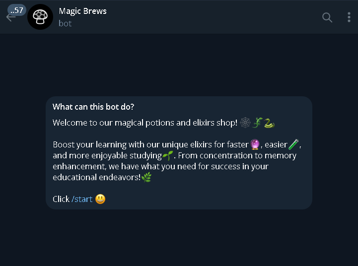
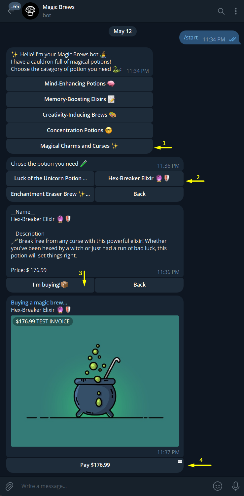
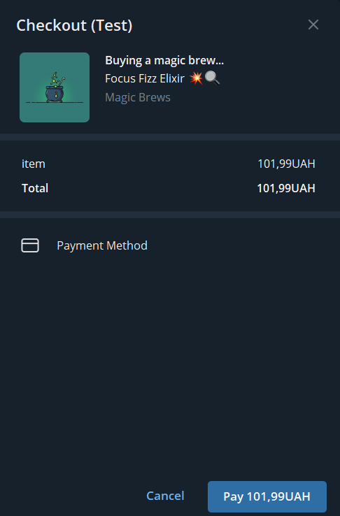

# Magic Brews Bot 🪄

---


> Magic Brews Bot is a fun Telegram bot that offers a variety of magical potions for all your mystical needs. 🧙‍♂️✨
---

## Features:

- Browse and purchase a wide range of magical potions.
- Explore different categories of potions such as Mind-Enhancing Elixirs, Memory-Boosting Brews, Creativity-Inducing Potions, Concentration Elixirs, and more.
- Easy to use interface with emoji-enhanced interactions. 🪄🔮
---

## Getting Started🔮:

1. **Navigate to the shop_bot directory:**
    ```shell
    cd shop_bot
    ```

3. **Run the bot:**
    ```shell
    python shop_main.py
    ```

---

## Usage:

1. Start a chat with the bot by searching for `@magic_brews_bot` in the Telegram app.
2. Select a category of potions you're interested in.
3. Browse through the potions available in that category.
4. Select a potion to view its details and purchase it.
5. Enjoy your magical potion! 🌟✨
---

## List of Technologies:

* **Programming Language:** `Python`
* **Telegram Bot Framework:** `aiogram`
* **Asynchronous Programming:** `asyncio`

## Additional Libraries:

* **JSON**: `json`
* **SQLAlchemy**: `sqlalchemy`
* **Aiofiles**: `aiofiles`
* **Aiosqlite**: `aiosqlite`
---
## Demo:

