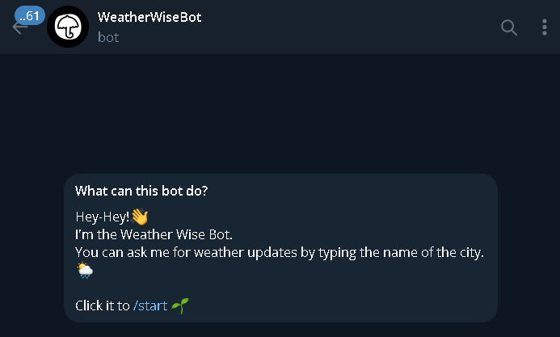

# Telegram Weather Bot

---


> Telegram Weather Bot is a simple bot that provides weather updates for different cities.
---
## Features

- Get current weather by typing the name of the city.
- Support for multiple cities.
- Easy to use, just type the city name and get the weather report.🙃
---

## Getting Started

1. **Navigate to the weather-bot directory:**
    ```shell
    cd weather_bot
    ```

2. **Create a `.env` file with the following format, replacing `YOUR_TG_TOKEN` and `YOUR_API_KEY` with your actual Telegram bot token and WeatherApi API key:**
    ```
    TG_TOKEN=YOUR_TG_TOKEN
    API_KEY=YOUR_API_KEY
    ```

    You can use the provided `.env_sample` as a pattern.


3. **Run the bot:**
    ```shell
    python weather_tg_bot.py
    ```

## Usage

1. Start a chat with the bot by searching for `@meteor_mind_bot` in the Telegram app.
2. Type the name of the city for which you want to get the weather report.
3. Receive the current weather report for the specified city 🎉.
---

## List of Technologies:

* **Programming Language:** `Python`
* **Telegram Bot Framework:** `aiogram`
* **Asynchronous Programming:** `asyncio`


## Additional Libraries:

* **HTTP Requests**: `requests`
* **Logging**: `logging`
* **Operating System Interfaces**: `os`
* **Date and Time Manipulation**: `datetime`
* **Mathematical Functions**: `math`
---
